  <a href="https://tarun-kamboj.github.io/">
    
     
  </a>

  
      
  

  
    
  
  
  
  
  
  
  
  
  
     
  
  
  
 
  <table align='center'>
    <tr>
      <td align='center'></td>
      <td align='center'></td>
      <td align='center'></td>
      <td align='center'></td>
      <td align='center'></td>
      <td align='center'></td>
    </tr>
    <tr>
      <td align='center'></td>
      <td align='center'></td>
      <td align='center'></td>
      <td align='center'></td>
      <td align='center'></td>
      <td align='center'></td>
    </tr>
    <tr>
      <td></td>
      <td align='center'></td>
      <td align='center'></td>
      <td align='center'></td>
      <td align='center'></td>
      <td></td>
    </tr>
  </table>
    

  
  
  

  <a href="https://photos.app.goo.gl/bZDFY6yErU6jKrZW7">
    
     
    
  </a>
   
  
  
  

<!--  -->
